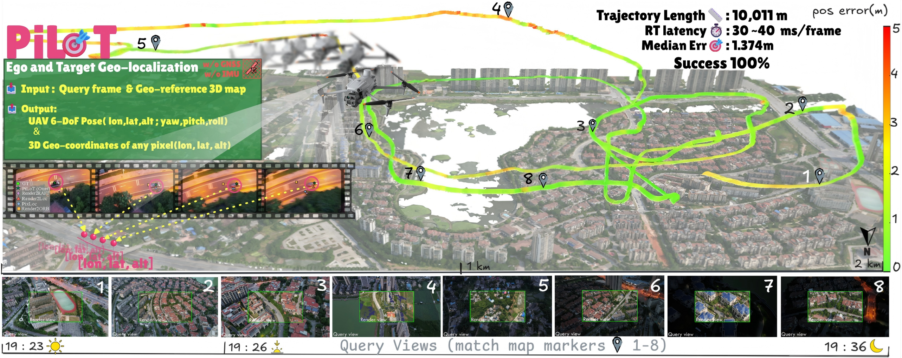

# PiLoT: Neural Pixel-to-3D Registration for UAV-based Ego and Target Geo-localization
[](LICENSE)
<!-- [](https://www.python.org/downloads/)
[](https://pytorch.org/) -->
[Website](https://nudt-sawlab.github.io/PiLoT/) | [arXiv](https://arxiv.org/abs/2603.20778) | [Dataset](https://huggingface.co/datasets/choyaa/PiLoT-data)

**PiLoT** is a a unified framework that tackles UAV-based ego and target geo-localization. Our system takes a live video frame and a geo-referenced 3D map as input, and outputs 1) the **UAV 6-DoF pose**, visualized by the tight alignment in the AR overlays (bottom row), and 2) the **3D geo-coordinates** of any target pixel, as shown in the dynamic target tracking example (left, filmstrip view). 
<!-- This repository contains the official implementation of our CVPR 2026 paper. -->
<p align="center">
  
</p>

## 📌 TODO

- [x] Inference code (3DGS rendering backend)
- [x] Demo data & pretrained model
- [x] Training data 
- [ ] Larger-area test scenes

## 🚀 Installation

### Step 1: Clone the Repository

```bash
git clone https://github.com/Choyaa/PiLoT.git
cd PiLoT
```

### Step 2: Create Conda Environment

```bash
conda env create -f environment.yaml
conda activate pilot
```


### Step 3: Install CUDA Extensions

Pre-built binaries are provided for Python 3.8 / 3.9 / 3.10 (Linux x86_64):

```bash
cd DirectAbsoluteCostCuda
pip install .
cd ..
```
### Step 4: Install 3DGS Dependencies

```bash
pip install plyfile pyproj
pip install git+https://github.com/graphdeco-inria/diff-gaussian-rasterization.git
pip install git+https://github.com/graphdeco-inria/gaussian-splatting.git#subdirectory=submodules/simple-knn
```

<!-- ### Step 4: Build 3D Tiles Renderer (Optional)

If you need to use the OpenSceneGraph-based 3D tiles renderer:

```bash
cd 3DTilesRender
mkdir build && cd build
cmake .. -DBUILD_AS_PYTHON_MODULE=ON
make -j$(nproc)
cd ../..
``` -->

## 🚀 Quick Start: 3DGS Demo

> **Note on rendering backend**: The experiments in our paper use **3D Tiles** models with a proprietary renderer. Due to licensing restrictions on the renderer, we provide a **3DGS** backend here instead. The demo scene covers a partial area of Jadebay, reconstructed from data in [ThermalGS / TSDN](https://github.com/porcofly/ThermalGS-and-TSDN-Dataset). We plan to release a larger Jadebay model and additional query sequences in the future.

### 1. Download Demo Data

Download the [3DGS demo data and pretrained model](https://drive.google.com/file/d/17rCLllEqofPjhZ-3tix1NyElViOgPdKo/view?usp=sharing):

Extract `data_demo` to the repository root:

```
data_demo/
├── Jadebay_3dgs_model/                  # 3DGS Gaussian model (single PLY)
│   └── point_cloud.ply
├── pretrained_model/
│   └── model@mapscape@512@Fourier.ckpt   # PiLoT feature / refiner checkpoint
└── query/
    ├── images/
    │   └── 3dgs_test/                   # same name as --name
    │       ├── 0_0.png
    │       └── ...
    └── poses/
        └── 3dgs_test.txt                # image_name lon lat alt roll pitch yaw
```
### 3. Run the Demo

```bash
python main.py \
    --config configs/feicuiwan_3dgs.yaml \
    --name 3dgs_test

# With visualization (saved renders + overlay mp4):
python main.py --config configs/feicuiwan_3dgs.yaml --name 3dgs_test --viz
```

Optional flags:

- `--viz` / `--no-viz` — override YAML `enable_visualization`. **`--viz`** is slower (saves images). **`outputs/`**: estimated poses; with **`--viz`**, also per-frame renders + `visualization.mp4`. 

The initial pose is read from the first line of `data_demo/query/poses/<name>.txt` (e.g. `3dgs_test.txt`). You can also use `run_feicuiwan.sh`, which reads the same pose file — set `--config` to `configs/feicuiwan_3dgs.yaml` in the script.

---

## 📦 Dataset Preparation

### Dataset Structure

Organize your dataset in the following structure:

```
dataset_root/
├── images/
│   └── sequence_name/
│       ├── 0000.png
│       ├── 0001.png
│       └── ...
├── poses/
│   └── sequence_name.txt
├── bbox/
│   └── sequence_name/
│       └── sequence_name_xy.txt
└── target_RTK/
    └── sequence_name_RTK.txt
```

### Pose File Format

The pose file (`sequence_name.txt`) should contain one pose per line:

```
image_name lon lat alt roll pitch yaw
0000.png 114.2604 22.2078 38.8901 0.0 25.0 314.9993
0001.png 114.2605 22.2079 38.8902 0.1 25.1 315.0000
...
```

### Target Points File Format

The target points file (`sequence_name_xy.txt`) should contain:

```
image_name x y
0000.png 1920.0 1080.0
0001.png 1920.0 1080.0
...
```

### Download Datasets

For evaluation datasets, please refer to the specific dataset documentation. Example datasets include:

- Custom UAV sequences
- Large-scale urban scenes
- Synthetic datasets

## 🎮 Usage

### Basic Usage

Run localization on a sequence:

```bash
./run_feicuiwan.sh
```

### Command Line Arguments

```bash
python main.py \
    --config CONFIG_FILE          # Path to configuration file
    --name DATASET_NAME           # Dataset name override
    --init_euler "[p, r, y]"      # Initial Euler angles (optional)
    --init_trans "[x, y, z]"      # Initial translation (optional)
```

<!-- ### Example Scripts

We provide example scripts for different scenarios:

```bash
# Run on Feicuiwan dataset
bash run_feicuiwan.sh

# Run on Google dataset
bash run_google.sh

# Run on UAV scenes
bash run_uavscenes.sh
```

### Evaluation

After running localization, evaluation metrics are automatically computed:

- **Position Error**: Translation error in meters (XYZ)
- **Orientation Error**: Rotation error in degrees (Euler angles)

Results are saved in the `outputs/` directory. -->

## ⚙️ Configuration

Configuration files are located in `configs/`. Each configuration file contains:

### Render Configuration

```yaml
render_config:
  model_path: "http://localhost:8078/Scene/Production_6.json"
  render_camera: [width, height, cx, cy, fx, fy]
  max_size:960/512 # render width
  width: 3840  # query width
  height: 2160 # query height
  params: [2700.0, 2700.0, 1915.7, 1075.1] # query [fx, fy, cx, cy]
  distortion: [0.0046, 0.1294, 0, 0.0012, -0.2037] # uery distortion
  dataset_path: "data_demo/query"
```

### Localization Configuration
```yaml
default_confs:
  cam_query:
    max_size: render width  
    width: w
    height: h
    params: [fx, fy, cx, cy]
    distortion: [k1, k2, p1, p2, k3]
  dataset_path: "/path/to/dataset"
  dataset_name: "sequence_name"
  num_init_pose: 64  # seeds
  padding: true
```

<!-- ## 🔬 Training (Optional)

<!-- To train your own models: -->

<!-- ```bash
python -m pixloc.pixlib.train experiment_name \
    --conf pixloc/pixlib/configs/train_pixloc_megadepth.yaml
``` -->

## 📝 Citation

If you use PiLoT in your research, please cite:

```bibtex
@inproceedings{cheng2026pilot,
  title={PiLoT: Neural Pixel-to-3D Registration for UAV-based Ego and Target Geo-localization},
  author={Cheng, Xiaoya and Wang, Long and Liu, Yan and Liu, Xinyi and Tan, Hanlin and Liu, Yu and Zhang, Maojun and Yan, Shen},
  booktitle={Proceedings of the IEEE/CVF Conference on Computer Vision and Pattern Recognition},
  year={2026}
}
```

## 🙏 Acknowledgments

- Data sources and platform supported by [Google Earth](https://earth.google.com/web/) and [Cesium for Unreal](https://cesium.com/platform/cesium-for-unreal/).

