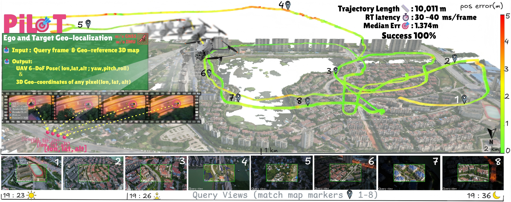

# PiLoT: Neural Pixel-to-3D Registration for UAV-based Ego and Target Geo-localization
[](LICENSE)

[Website](https://nudt-sawlab.github.io/PiLoT/) | [arXiv](https://arxiv.org/abs/2603.20778) | [Dataset](https://huggingface.co/datasets/choyaa/PiLoT-data)

**PiLoT** is a unified framework for UAV ego-localization and target geo-localization from a live frame and a geo-referenced 3D map.

<p align="center">
  
</p>

> **3DGS backend note:** Paper experiments used 3D Tiles with a proprietary renderer. This release provides two **3D Gaussian Splatting** map backends in one codebase — both run in the same `pilot` conda environment.

## 📌 TODO

- [x] Inference code (3DGS rendering backend)
- [x] Demo data & pretrained model
- [x] Training data
- [x] Training code
- [x] Improved pose refiner with spatio-temporal constraints (more robust)

## Agent Quick Start

Using an AI coding assistant (Cursor, Claude Code, Codex, etc.)? Open this repo and try:

| Goal | Prompt | Guide |
|------|--------|-------|
| **Install** | *"Read AGENTS.md and install PiLoT"* | [AGENTS.md](AGENTS.md) |
| **Run SMBU demo** | *"Download data and run SMBU seq2 with visualization"* | [AGENTS.md](AGENTS.md) · [docs/demos/smbu.md](docs/demos/smbu.md) |
| **Run Feicuiwan demo** | *"Run the Feicuiwan 3DGS demo"* | [AGENTS.md](AGENTS.md) · [docs/demos/feicuiwan.md](docs/demos/feicuiwan.md) |
| **Own data** | *"Read docs/custom_data.md and help me prepare my sequence"* | [docs/custom_data.md](docs/custom_data.md) |
| **Custom renderer** | *"Read docs/render_backends.md and add a Blender/OSG renderer"* | [docs/render_backends.md](docs/render_backends.md) |

## Two demo cases (same env, same entry point)

| Case | Scene | Renderer | Coordinates | Data |
|------|-------|----------|-------------|------|
| **1. SMBU** | Campus UAV seq2 | CityGaussian checkpoint | normalized `x y z` | `data_demo/` |
| **2. Feicuiwan** | Jadebay partial area | vanilla 3DGS PLY | ECEF `lon lat alt` | `data_demo/` |

```
PiLoT (main.py + learned optimizer)
    ├── citygs  → SMBU          configs/demos/smbu_seq2.yaml
    └── 3dgs    → Feicuiwan     configs/demos/feicuiwan.yaml
```

Details: [docs/coordinate_systems.md](docs/coordinate_systems.md)

## Installation

Full steps: **[docs/install.md](docs/install.md)**

Summary — one conda env named **`pilot`**, based on CityGaussian's `gspl` stack:

```bash
git clone https://github.com/Choyaa/PiLoT.git && cd PiLoT
git clone https://github.com/DekuLiuTesla/CityGaussian.git third_party/CityGaussian

cd third_party/CityGaussian
conda env create -f environment.yml -n pilot
conda activate pilot
cd ../..

pip install -r requirements.txt
cd DirectAbsoluteCostCuda && CUDA_HOME=/usr/local/cuda python setup_build.py install && cd ..

# For Feicuiwan (vanilla PLY renderer):
pip install git+https://github.com/graphdeco-inria/diff-gaussian-rasterization.git
pip install git+https://github.com/graphdeco-inria/gaussian-splatting.git#subdirectory=submodules/simple-knn
```

## Download data

From the repo root ([PiLoT-data](https://huggingface.co/datasets/choyaa/PiLoT-data) on Hugging Face):

```bash
pip install huggingface_hub
./scripts/download_data_demo.sh              # all (~15GB)
# ./scripts/download_data_demo.sh smbu       # SMBU only (~10GB)
# ./scripts/download_data_demo.sh feicuiwan  # Feicuiwan only (~4.5GB)
```

Unpacks to `./data_demo/`. Details: [data_demo/README.md](data_demo/README.md).

## Run

```bash
conda activate pilot
```

### Case 1: SMBU

```bash
./scripts/run_smbu_seq2.sh
./scripts/run_smbu_seq2.sh --viz          # save renders + video
```

Root wrapper: `./run_smbu_seq2_citygs.sh`

More: [docs/demos/smbu.md](docs/demos/smbu.md)

### Case 2: Feicuiwan

```bash
./scripts/run_feicuiwan.sh
./scripts/run_feicuiwan.sh 3dgs_test --viz
```

Root wrapper: `./run_feicuiwan_3dgs.sh`

More: [docs/demos/feicuiwan.md](docs/demos/feicuiwan.md)

### Direct Python

```bash
python main.py -c configs/demos/smbu_seq2.yaml
python main.py -c configs/demos/feicuiwan.yaml --name 3dgs_test
```

Outputs: `outputs/<output_name>.txt` (+ images with `--viz`).

## Your own data

Prepare query images, a pose file, and a 3D map that matches one of the render backends. Copy a demo config and point paths at your sequence.

Full checklist: **[docs/custom_data.md](docs/custom_data.md)**

Minimal layout:

```
data_demo/query/images/<seq>/   # 0_0.png, 1_0.png, ...
data_demo/query/poses/<seq>.txt
data_demo/<your_map>/           # CityGaussian ckpt or 3DGS PLY
```

```bash
python main.py -c configs/demos/my_seq.yaml --name <seq>
```

## Pluggable render backends

The render worker in `main.py` is backend-agnostic: it only needs `(color, depth)` per pose. Built-in types: `citygs`, `3dgs`, `osg`. You can add **Blender**, **Unreal**, mesh rasterizers, or other map servers by implementing the same `render(trans, euler)` interface.

How to extend: **[docs/render_backends.md](docs/render_backends.md)**

## Pose file formats

| Case | Columns |
|------|---------|
| SMBU | `image_name x y z pitch roll yaw` |
| Feicuiwan | `image_name lon lat alt roll pitch yaw` |

## Configuration

- Official demos: `configs/demos/`
- Legacy / internal: `configs/legacy/`
- Paths support env vars: `${CITYGAUSSIAN_ROOT:-third_party/CityGaussian}`, `${SMBU_MODEL_DIR:-data_demo/smbu_model}`

| Key | SMBU | Feicuiwan |
|-----|------|-----------|
| `render_config.type` | `citygs` | `3dgs` |
| `coordinate_system` | `normalized` | `ecef` |
| `trust_prior_sequential` | `false` (7×7 yaw/pitch seeds) | `false` |

## Project layout

```
PiLoT/
├── main.py
├── configs/demos/          # smbu_seq2, feicuiwan
├── scripts/                # run_smbu_seq2.sh, run_feicuiwan.sh
├── data_demo/              # all demo data (download from Hugging Face)
├── third_party/CityGaussian/
├── pixloc/                 # localization core
└── docs/                   # install, custom data, render backends, demos
```
```

## Citation

```bibtex
@inproceedings{cheng2026pilot,
  title={PiLoT: Neural Pixel-to-3D Registration for UAV-based Ego and Target Geo-localization},
  author={Cheng, Xiaoya and Wang, Long and Liu, Yan and Liu, Xinyi and Tan, Hanlin and Liu, Yu and Zhang, Maojun and Yan, Shen},
  booktitle={Proceedings of the IEEE/CVF Conference on Computer Vision and Pattern Recognition},
  year={2026}
}
```

## Acknowledgments

Data sources and platform supported by [Google Earth](https://earth.google.com/web/) and [Cesium for Unreal](https://cesium.com/platform/cesium-for-unreal/).
